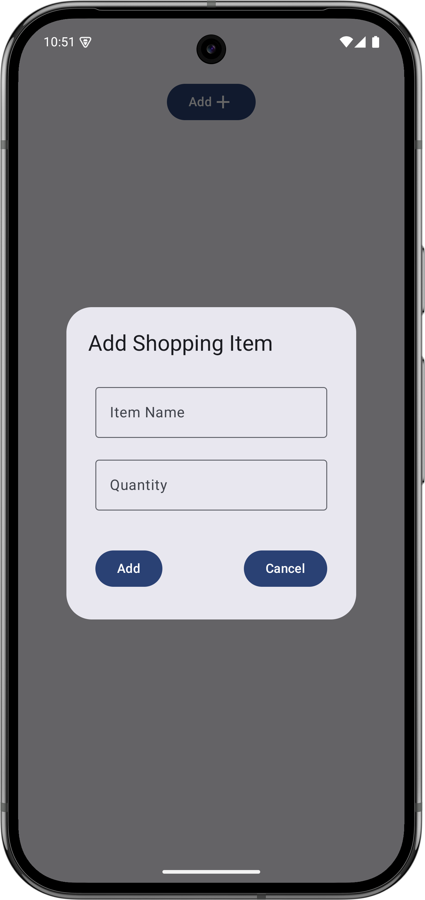
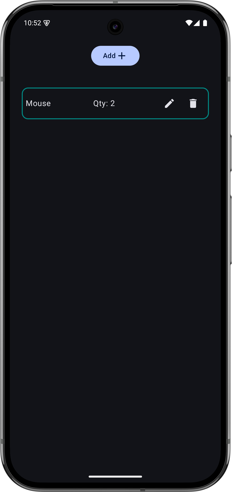

# 📝 Shopping List App

[](https://kotlinlang.org/)
[](https://developer.android.com/about/versions/13)
[](https://developer.android.com/jetpack/compose)
[](https://opensource.org/licenses/MIT)
[](https://github.com/rathee-dev/Shopping-List)

A modern, clean, and intuitive **Shopping List** application built with **Jetpack Compose** and **Material Design 3**. This app helps you manage your grocery or any other shopping needs efficiently with a smooth user experience.

---

## 📸 Screenshots

| Home Screen | Add Item Dialog |
|:---:|:---:|
|  |  |

---

## ✨ Features

- **🚀 Quick Add:** Easily add items to your list with a dedicated "Add Item" button.
- **🔢 Quantity Management:** Specify the quantity for each item.
- **✏️ Inline Editing:** Edit item names and quantities directly within the list.
- **🗑️ Swipe/Click to Delete:** Remove items you no longer need with a single tap.
- **🎨 Modern UI:** Beautifully designed using Material 3 components and Jetpack Compose.
- **📱 Responsive Design:** Works seamlessly across different screen sizes.

---

## 🛠️ Tech Stack

- **Language:** [Kotlin](https://kotlinlang.org/) - 100% Type-safe and concise.
- **UI Framework:** [Jetpack Compose](https://developer.android.com/jetpack/compose) - Modern declarative UI toolkit.
- **Theme:** [Material Design 3](https://m3.material.io/) - Google's latest design system.
- **Architecture:** MVVM (Model-View-ViewModel) pattern for clean code separation.
- **Build Tool:** Gradle with Kotlin DSL.

---

## 🚀 Getting Started

To get a local copy up and running, follow these simple steps:

### Prerequisites

- Android Studio Flamingo or later.
- JDK 17 or higher.

### Installation

1. **Clone the repository:**
   ```bash
   git clone https://github.com/rathee-dev/Shopping-List.git
   ```

2. **Open the project:**
   - Launch Android Studio.
   - Select `Open an Existing Project`.
   - Navigate to the cloned folder and select either `ShoppingListApp` or `MyShoppingList`.

3. **Build and Run:**
   - Sync the project with Gradle files.
   - Connect your Android device or start an emulator.
   - Click the **Run** button (green play icon).

---

## 📁 Project Structure

The project is organized into two main modules for demonstration and comparison:

- **`ShoppingListApp/`**: The primary version of the application with updated dependencies and Material 3 implementation.
- **`MyShoppingList/`**: A variant of the shopping list app exploring different UI approaches and state management.

Key files:
- `MainActivity.kt`: Entry point of the application.
- `ShoppingList.kt`: Core Composable logic for the shopping list UI.
- `ui/theme/`: Custom color palettes, typography, and theme definitions.

---

## 🤝 Contributing

Contributions are what make the open-source community such an amazing place to learn, inspire, and create. Any contributions you make are **greatly appreciated**.

1. Fork the Project.
2. Create your Feature Branch (`git checkout -b feature/AmazingFeature`).
3. Commit your Changes (`git commit -m 'Add some AmazingFeature'`).
4. Push to the Branch (`git push origin feature/AmazingFeature`).
5. Open a Pull Request.

---

## 📄 License

Distributed under the MIT License. See `LICENSE` for more information.

---

## 👨‍💻 Author

**Himanshu Rathee** - [@rathee-dev](https://github.com/rathee-dev)

- GitHub: [rathee-dev](https://github.com/rathee-dev)
- Project Link: [https://github.com/rathee-dev/Shopping-List](https://github.com/rathee-dev/Shopping-List)

---

Developed with ❤️ by [rathee-dev](https://github.com/rathee-dev)
